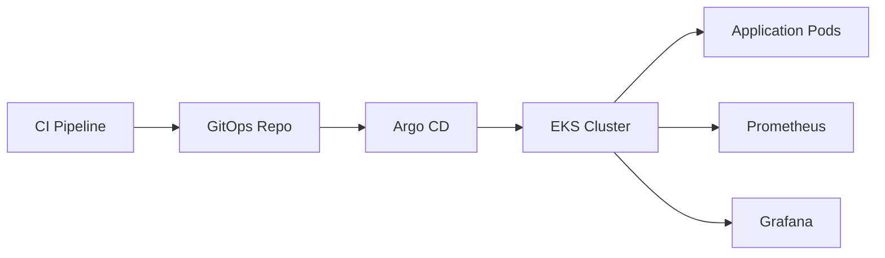

# ⚙️ GitOps CD Pipeline — EKS + Argo CD + Terraform

## 🏗️ Overview

This repository implements **Continuous Delivery using GitOps principles**.

It manages:

- Kubernetes manifests  
- Infrastructure provisioning (Terraform)  
- Argo CD applications  
- Monitoring stack  

---

## 🔄 Architecture

🔁 GitOps Workflow
1. CI updates image tag
2. GitOps repo reflects change
3. Argo CD detects drift
4. Cluster auto-syncs

🚫 No manual deployments

☁️ Infrastructure (Terraform)

Provisioned:

- EKS cluster
- Networking
- IAM roles
- Argo CD

🚀 Argo CD Setup
- kubectl create namespace argocd

- kubectl apply -n argocd \ -f https://raw.githubusercontent.com/argoproj/argo-cd/stable/manifests/install.yaml

- kubectl patch svc argocd-server -n argocd \ -p '{"spec": {"type": "LoadBalancer"}}'

🔐 Argo CD Access
- kubectl -n argocd get secret argocd-initial-admin-secret \ -o jsonpath="{.data.password}" | base64 -d

📊 Monitoring (Prometheus + Grafana)
- kube-prometheus-stack via Helm
- Real-time cluster visibility
- Grafana exposed via LoadBalancer

🧪 Verification
kubectl get pods -n monitoring
kubectl get endpoints -n monitoring

🔐 Grafana Password
- kubectl get secret monitoring-grafana -n monitoring \ -o jsonpath="{.data.admin-password}" | base64 --decode

📊 Metrics

| Capability      | Status  |
| --------------- | ------- |
| Auto Deployment | ✅       |
| Self-Healing    | ✅       |
| Drift Detection | ✅       |
| Observability   | ✅       |
| Manual Steps    | Minimal |

⚠️ Challenges Solved
- Argo CD drift (image mismatch)
- Terraform S3 backend permissions
- Prometheus no data issue
- Kubernetes service/ingress debugging

📌 Future Improvements
- Ingress controller (ALB)
- TLS (cert-manager)
- Alerting system
- Helm packaging

💡 Philosophy

Git is the single source of truth in GitOps.
